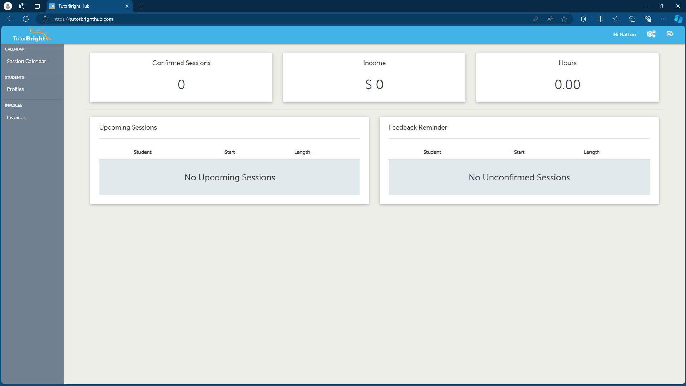
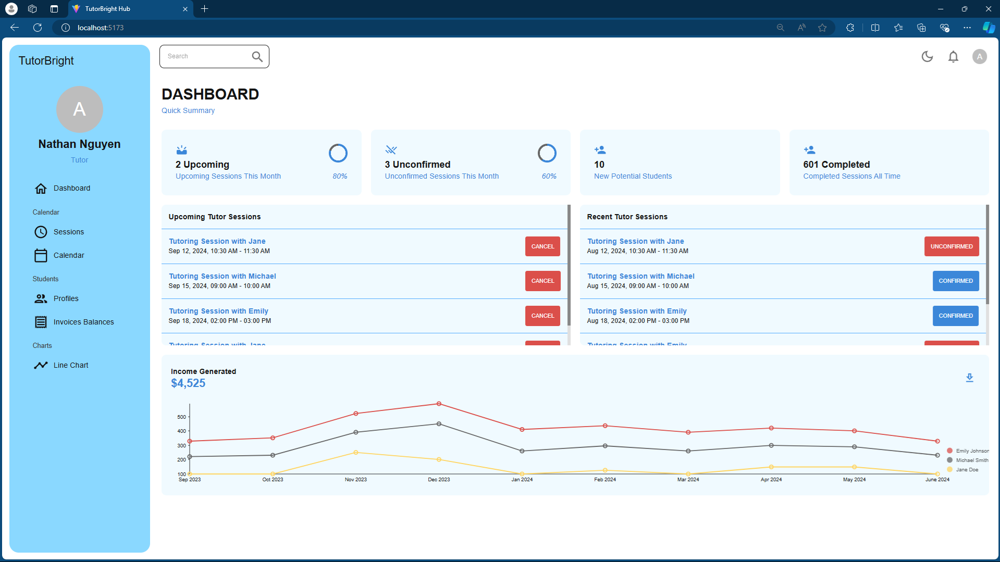
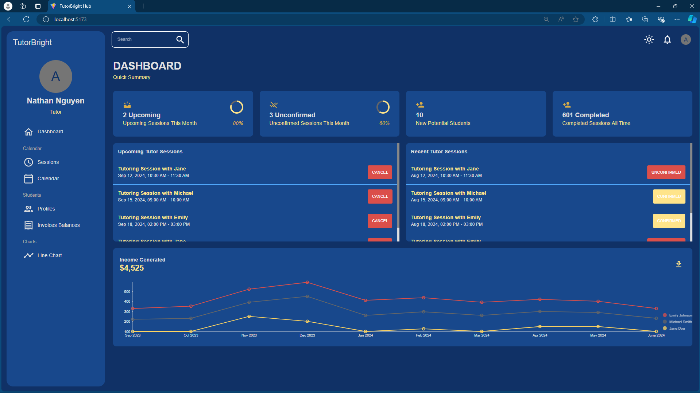
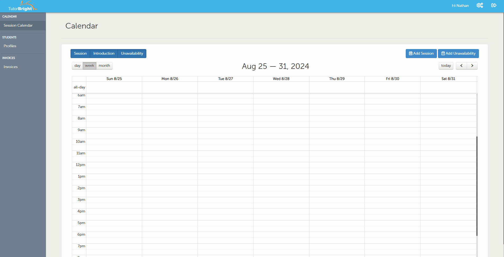
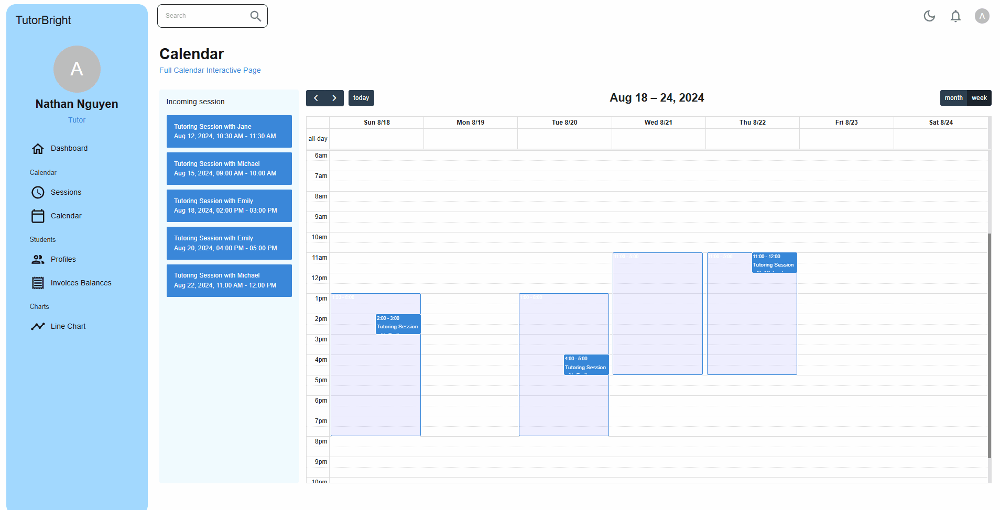

# Improved TutorBright Hub

## This is a small project/demo that proposes an upgrade to the existing TutorBright Hub 2.0, following the challenges faced with the 3.0 launch and had to roll back. The upgrade includes introducing a drag-and-drop feature for FullCalendar.js, along with various quality-of-life and visual improvements to streamline the user experience.

#### *Framework & Libraries: React.js, MaterialUI, FullCalendar.js, Nivo line chart*

### Dashboard

#### Original dashboard:

#### Improved dashboard:
Suggestion: 
- Improve overall visual of the page
- Showing number of potential students depends on the availability of the tutor
- Showing number of sessions that the tutor has completed as an achievement
- Adding graph for incoming and an individual line for each student
- [Displaying upcoming tutor sessions on the side and adding drag-and-drop feature to add tutor availability](#calendar)

*Light mode*

*Dark mode*

### Calendar

#### Original calendar:

#### Improved calendar:
- Displaying upcoming tutor sessions on the side
- Adding drag-and-drop feature to add tutor availability instead of typing in data and time range

*Default prompt will be changed to a nicer pop-up window if the proposal get accepted*
